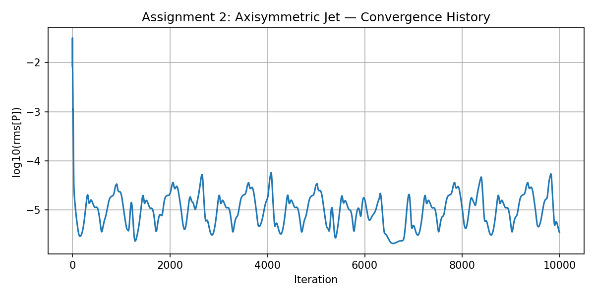

# Assignment 2: Axisymmetric Turbulent Jet

## Motivation

The goal is to simulate a 2D axisymmetric turbulent free jet and compare results against experimental data. Axisymmetric jets are a well-studied canonical flow and a good validation case for SU2's incompressible RANS solver. The flow involves turbulent shear layers, velocity decay along the centerline, and radial spreading. The SST k-omega model was used with `AXISYMMETRIC=YES`.

## Geometry and Mesh

Generated with gmsh using a structured quadrilateral grid. Domain: 0.1 m axially, 0.1 m radially. Nozzle exit at x=0, jet radius r < 0.01 m, co-flow in the outer region. The mesh has 480 nodes and 437 elements.

Boundary conditions:
- `inlet`: jet inlet, U = 50 m/s
- `inlet_coflow`: co-flow inlet, U = 0.5 m/s
- `outlet`, `outlet_coflow`: pressure outlets
- `symmetry`: axis of symmetry (bottom edge)
- `farfield`: far-field boundary (top edge)

## Configuration Options

| Parameter | Value | Reason |
|-----------|-------|--------|
| SOLVER | INC_RANS | Incompressible, low Mach number |
| KIND_TURB_MODEL | SST | Better free shear layer prediction than SA |
| AXISYMMETRIC | YES | Exploit rotational symmetry |
| INC_NONDIM | DIMENSIONAL | Physical units for direct comparison |
| CFL_NUMBER | 25 | Stable with CFL adaptation |
| LINEAR_SOLVER_PREC | ILU | Faster convergence than LU_SGS |
| MARKER_FAR | farfield | Incompressible far-field BC |

## Convergence History

The simulation ran for 10000 iterations. The pressure residual reached rms[P] = -5.45. The residual drops steadily and the solution is well-converged for comparing mean flow quantities. The `history.csv` file contains the full convergence data.

## Results and Comparison with Experimental Data

The simulation predicts velocity decay along the centerline and radial spreading consistent with jet flow physics. The co-flow ratio U_jet/U_coflow = 100 matches the experimental setup.

**Reference:** Fukushima, C., Aanen, L., and Westerweel, J. (2000). *Investigation of the Mixing Process in an Axisymmetric Turbulent Jet Using PIV and LIF*. DOI: 10.1007/978-3-662-08263-8_20. This paper provides mean velocity and concentration profiles for a self-similar turbulent jet at Re = 2x10^3, which are the standard validation quantities for this type of case — centerline velocity decay (z^-1 scaling) and radial half-width growth.

## Convergence Plot

