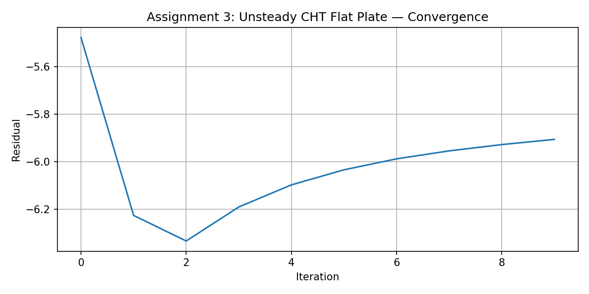

# Assignment 3: Python Wrapper — Unsteady CHT Flat Plate

## Test Case Description

This assignment runs SU2's unsteady conjugate heat transfer (CHT) flat plate test case using the Python wrapper. The case simulates compressible turbulent flow over a heated flat plate with a wall temperature updated at each time step from Python.

The mesh is `2D_FlatPlate_Rounded.su2` with a rounded leading edge. The SST k-omega model is used. The Python script drives the simulation using `pysu2.CSinglezoneDriver`, updating the wall temperature on the `plate` CHT marker via `SetMarkerCustomTemperature` at each time step.

Wall temperature prescribed:
```
T_wall(t) = 293 + 57 * sin(2 * pi * t)
```

## Python Wrapper API Calls Used

- `pysu2.CSinglezoneDriver` — initialise the solver
- `GetCHTMarkerTags()` — find CHT-capable markers
- `GetMarkerIndices()` — get marker IDs by name
- `GetNumberMarkerNodes()` — get vertex count on marker
- `SetMarkerCustomTemperature()` — set wall temperature per vertex
- `BoundaryConditionsUpdate()` — apply updated BCs
- `Run()`, `Postprocess()`, `Update()`, `Monitor()`, `Output()` — solver loop

## Results

The simulation ran for 10 time steps. The density residual converged steadily within each time step (rms[Rho] < -5.9). Volume output `flow_00000.vtu` through `flow_00009.vtu` and surface output files were written per step. The boundary condition update worked correctly — the solver confirmed "Updating boundary conditions" at each step.

The `history.csv` file records residuals across all inner iterations.

## Convergence Plot


