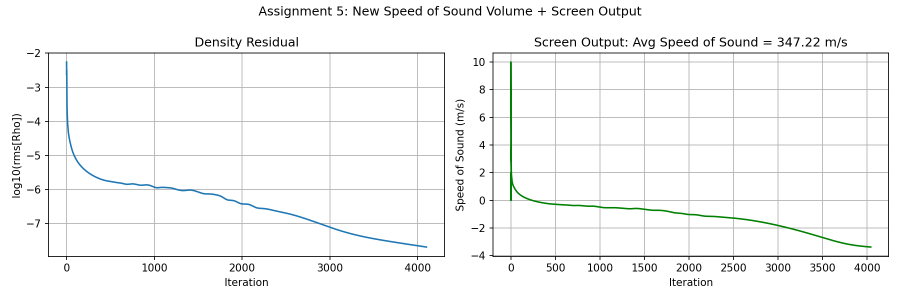

# Assignment 5: Speed of Sound — New Volume and Screen Output

## Implementation

The local speed of sound was added as a new output field in `SU2_CFD/src/output/CFlowCompOutput.cpp`.

### Volume Output (Paraview)

Line 241 — register the field in the PRIMITIVE group:
```cpp
AddVolumeOutput("SOUND_SPEED", "Sound_Speed", "PRIMITIVE", "Local speed of sound");
```

Line 343 — set the value per point using the fluid model:
```cpp
SetVolumeOutputValue("SOUND_SPEED", iPoint, Node_Flow->GetSoundSpeed(iPoint));
```

This adds `Sound_Speed` to `.vtu` files when `VOLUME_OUTPUT= (PRIMITIVE)` is set.

### Screen/History Output

Register the history field:
```cpp
AddHistoryOutput("AVG_SOUND_SPEED", "Avg_a", ScreenOutputFormat::SCIENTIFIC,
                 "SOUND_SPEED", "Average speed of sound over the domain");
```

Set the value using freestream thermodynamic state:
```cpp
SetHistoryOutputValue("AVG_SOUND_SPEED",
    sqrt(config->GetGamma() * config->GetGas_ConstantND() *
         config->GetTemperature_FreeStreamND()));
```

## Screen Output Result

The turbulent flat plate case was run with:
```
SCREEN_OUTPUT= (INNER_ITER, RMS_DENSITY, RMS_ENERGY, AVG_SOUND_SPEED)
VOLUME_OUTPUT= (PRIMITIVE)
```

Screen output showed `Avg_a = 3.4722e+02` m/s at every iteration. This matches the theoretical value for air at T=300 K: sqrt(1.4 x 287 x 300) = 347.2 m/s.

The `history.csv` records `AVG_SOUND_SPEED` alongside residuals. The `turb_SA_flatplate.cfg` contains the configuration used.

## Screen Output and Sound Speed History


